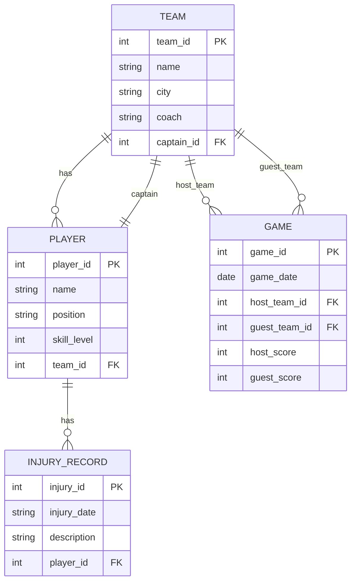

```mermaid
erDiagram
    TEAM {
        int team_id PK
        string name
        string city
        string coach
        int captain_id FK
    }

    PLAYER {
        int player_id PK
        string name
        string position
        int skill_level
        int team_id FK
    }

    INJURY_RECORD {
        int injury_id PK
        string injury_date
        string description
        int player_id FK
    }

    GAME {
        int game_id PK
        date game_date
        int host_team_id FK
        int guest_team_id FK
        int host_score
        int guest_score
    }

    TEAM ||--o{ PLAYER : has
    PLAYER ||--o{ INJURY_RECORD : has
    TEAM ||--|| PLAYER : captain
    TEAM ||--o{ GAME : host_team
    TEAM ||--o{ GAME : guest_team
```
